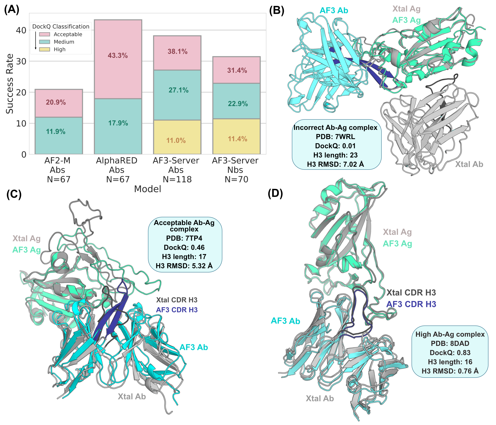

Read our paper here: [What has AlphaFold3 learned about antibody and nanobody docking, and what remains unsolved?](https://www.biorxiv.org/content/10.1101/2024.09.21.614257)

The full dataset of cleaned & formatted crystal structures and AF3 predictions can be found here: [https://zenodo.org/records/14722282](https://zenodo.org/records/14722282)

---

We provide relevant code for benchmarking and visualizing results here.

We have made our code files available to encourage standardized benchmarking for new algorithms and benchmarks to expand on. 

The conda environment file is made available - `environment.yml`, as are the python packages - `requirements.txt`. 

You can re-create the conda environment through the command: `conda env create -f environment.yml`. 

Install the python packages after activating the new environment through `pip install -r requirements.txt`. (try this `pip3 install -r requirements.txt` if `pip` doesn't work).

--- 

## Code Structure:

all files named `run_*.sh` are SLURM scripts that can be used to run files in the `scripts` folder

Folder `scripts` contains useful python scripts.
* `h3_plddt_extract.py` calculates average CDR H3 pLDDT (can run via SLURM file: `run_h3plddt_extract.sh`)
* `iplddt_calc.py` calculates I-pLDDT (can run via SLURM file: `run_iplddt.sh`)
* `rmsds.py` does RMSD calculations for all antibody/nanobody regions (global RMSD) AND the local CDR H3 loop RMSD (can run via SLURM file: `run_renum_rmsd.sh`)
* `bindenergy_with_datastruc.py` calculates the Rosetta-based binding energy for complexes (can run via SLURM file: `run_energies.sh`)
* `interface_fast_relaxer.py` conducts a FastRelax and calculates the new binding energy for complexes (can run via SLURM file: `run_relaxenergies.sh`)
* `dockq_calc_withdatastruc.py` calculates the DockQ score for complexes (can run via SLURM file: `run_dockq.sh`)
* `renum_igfold_af3.py` automates PDB file renumbering (can run via SLURM file: `run_renumbering.sh`)
* `ciftoPDB.py` converts mmCIF files (AF3 preferred output) to PDB files

All scripts take in 1-2 arguments through commandline: pandas dataframes that hold the file directory and file name as well as other meta tags (ex. bound/unbound, antibody/nanobody, etc.). Though we *highly* recommend using dataframe querying, these can be edited as needed. The second argument (if needed) is the csv filepath for outputting calculation results.

--- 

## Visualization

The `analysis.ipynb` file is a Jupyter notebook contains all the experiments and relevant graph generating code from this paper.

--- 

## Cite

Please cite our pre-print if you use any of our code or data! 

---

## Contact us

Please post issues as you use this work. We'd love to help where we can. Thank you!

